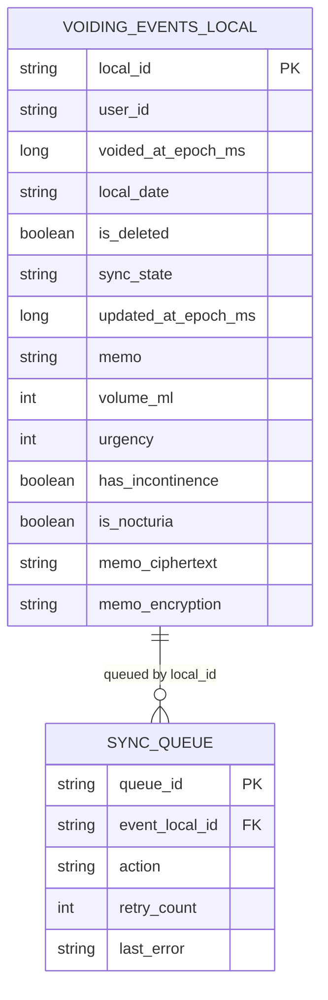
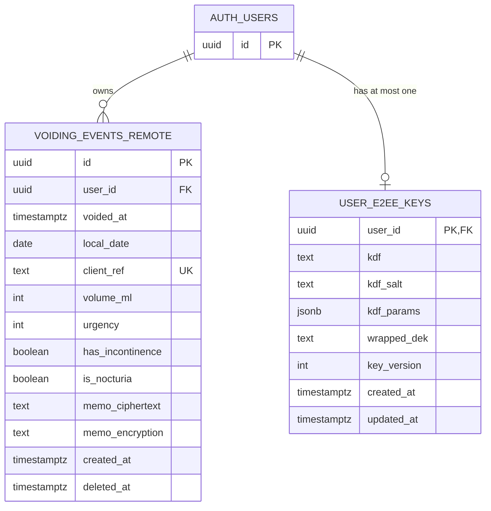

# Data Model ER

## 목적

이 문서는 bladder-diary가 현재 사용 중인 주요 테이블 구조를 빠르게 파악하기 위한 ER 다이어그램 문서다.
로컬 Room DB와 원격 Supabase DB를 분리해서 보여준다.

## 범위

- 로컬 DB
  - `voiding_events`
  - `sync_queue`
- 원격 DB
  - `public.voiding_events`
  - `public.user_e2ee_keys`
  - 외부 참조 `auth.users`

## 로컬 DB ER

## 원격 DB ER

## 로컬-원격 매핑 메모

- 로컬 `voiding_events.local_id`는 원격 `public.voiding_events.id`와 같은 이벤트 식별자로 사용된다.
- 원격 `client_ref`도 현재 구현상 로컬 `local_id`와 동일한 값을 담는다.
- 로컬 `sync_queue.event_local_id`는 로컬 `voiding_events.local_id`를 참조하는 논리적 FK다.
- 로컬 `memo`는 앱에서 사용하는 평문 또는 복호화 결과 캐시 성격이고, 원격에는 `memo_ciphertext`와 `memo_encryption`이 저장된다.
- 원격 `user_e2ee_keys`는 사용자별 E2EE 메타데이터와 wrapped DEK를 1건만 유지한다.

## 참고 기준 파일

- `app/src/main/java/com/bladderdiary/app/data/local/AppDatabase.kt`
- `app/src/main/java/com/bladderdiary/app/data/local/VoidingEventEntity.kt`
- `app/src/main/java/com/bladderdiary/app/data/local/SyncQueueEntity.kt`
- `app/src/main/java/com/bladderdiary/app/data/remote/dto/VoidingEventRemoteDto.kt`
- `app/src/main/java/com/bladderdiary/app/data/remote/dto/UserE2eeKeyRemoteDto.kt`
- `supabase/sql/001_init.sql`
- `supabase/sql/002_e2ee_memo.sql`
- `supabase/sql/003_add_volume_ml.sql`
- `supabase/sql/004_add_urgency.sql`
- `supabase/sql/005_add_has_incontinence.sql`
- `supabase/sql/006_add_is_nocturia.sql`
